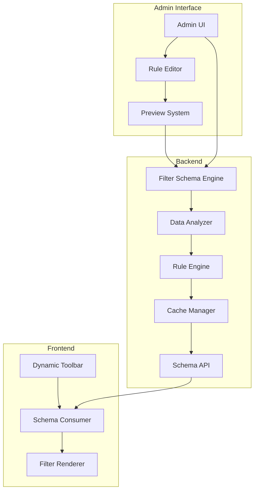
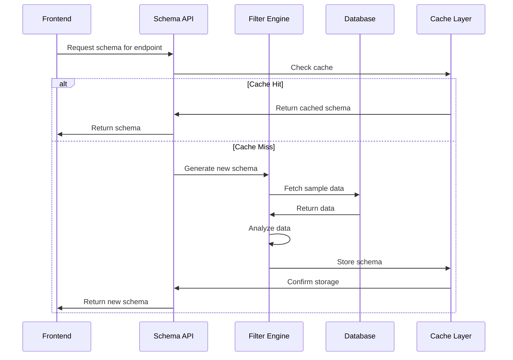
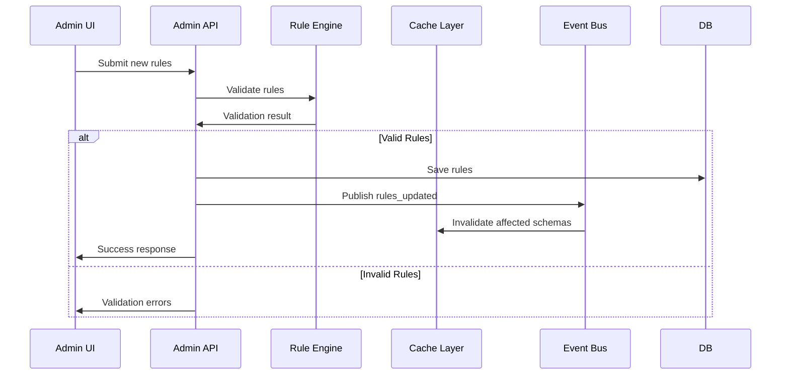
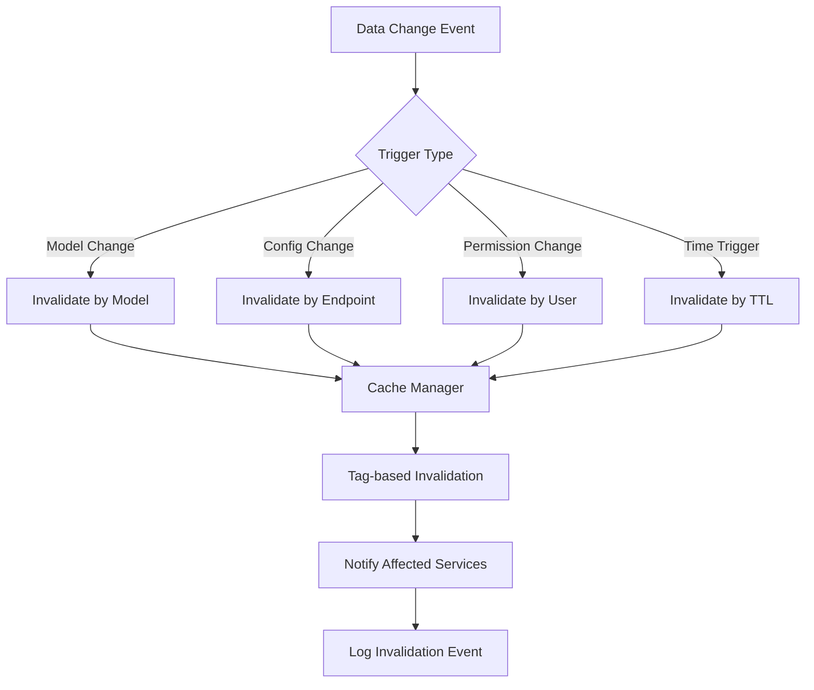

# Arquitectura del Sistema de Filtros Dinámicos

## Tabla de Contenidos
- [1. Resumen Ejecutivo](#1-resumen-ejecutivo)
- [2. Arquitectura Actual vs Propuesta](#2-arquitectura-actual-vs-propuesta)
- [3. Componentes del Sistema](#3-componentes-del-sistema)
- [4. Especificaciones Técnicas](#4-especificaciones-técnicas)
- [5. Flujos de Datos](#5-flujos-de-datos)
- [6. Plan de Implementación](#6-plan-de-implementación)
- [7. Consideraciones de Seguridad](#7-consideraciones-de-seguridad)
- [8. Métricas y Monitoreo](#8-métricas-y-monitoreo)

---

## 1. Resumen Ejecutivo

### 1.1 Objetivo
Crear un sistema de filtros dinámicos para DataTables que se auto-configure basándose en metadatos generados por un motor backend, eliminando la necesidad de configuración manual y proporcionando una experiencia completamente dinámica.

### 1.2 Problema Actual
- Configuración manual de filtros por cada endpoint
- Análisis de tipos en frontend (ineficiente)
- Dificultad para mantener filtros actualizados
- Limitaciones para escalar a múltiples proyectos

### 1.3 Solución Propuesta
Motor backend que analiza automáticamente la estructura de datos y genera schemas de filtros con cache inteligente y interfaz de administración.

---

## 2. Arquitectura Actual vs Propuesta

### 2.1 Arquitectura Actual


**Limitaciones:**
- Análisis en cliente (performance)
- Configuración estática
- Duplicación de lógica

### 2.2 Arquitectura Propuesta


---

## 3. Componentes del Sistema

### 3.1 Backend Components

#### 3.1.1 Filter Schema Engine
**Responsabilidad:** Motor principal de análisis y generación de schemas

```typescript
interface FilterSchemaEngine {
  // Análisis de endpoint
  analyzeEndpoint(config: EndpointConfig): Promise<FilterSchema>
  
  // Aplicación de reglas personalizadas
  applyCustomRules(schema: FilterSchema, rules: AdminRules): FilterSchema
  
  // Validación de schemas
  validateSchema(schema: FilterSchema): ValidationResult
  
  // Generación de fallbacks
  generateFallback(endpoint: string): BasicFilterSchema
}

interface EndpointConfig {
  url: string
  method: string
  sampleSize?: number
  userPermissions?: string[]
  cacheStrategy?: CacheStrategy
}
```

#### 3.1.2 Data Analyzer
**Responsabilidad:** Análisis estadístico e inferencia de tipos

```typescript
interface DataAnalyzer {
  // Análisis estadístico de campos
  analyzeField(fieldName: string, values: any[]): FieldAnalysis
  
  // Detección de patrones
  detectPatterns(values: any[]): PatternAnalysis
  
  // Inferencia de relaciones
  inferRelationships(data: Record<string, any>[]): RelationshipMap
  
  // Análisis de cardinalidad
  analyzeCardinality(values: any[]): CardinalityAnalysis
}

interface FieldAnalysis {
  dataType: 'string' | 'number' | 'boolean' | 'date' | 'object' | 'array'
  filterType: 'faceted' | 'search' | 'range' | 'boolean' | 'custom'
  uniqueValues: any[]
  uniqueCount: number
  nullCount: number
  patterns: string[]
  distribution: StatisticalDistribution
  suggestedConfig: FilterConfig
}
```

#### 3.1.3 Rule Engine
**Responsabilidad:** Aplicación de reglas de negocio y configuraciones admin

```typescript
interface RuleEngine {
  // Aplicación de reglas globales
  applyGlobalRules(schema: FilterSchema): FilterSchema
  
  // Aplicación de reglas por endpoint
  applyEndpointRules(schema: FilterSchema, rules: EndpointRules): FilterSchema
  
  // Validación de reglas
  validateRules(rules: AdminRules): ValidationResult[]
  
  // Resolución de conflictos
  resolveConflicts(rules: AdminRules[]): ResolvedRules
}

interface AdminRules {
  global: GlobalRules
  endpoints: Record<string, EndpointRules>
  fields: Record<string, FieldRules>
  permissions: PermissionRules
}

interface GlobalRules {
  facetedThreshold: number
  searchMinLength: number
  maxCacheTime: number
  fallbackStrategy: FallbackStrategy[]
}
```

#### 3.1.4 Cache Manager
**Responsabilidad:** Gestión inteligente de cache con invalidación por eventos

```typescript
interface CacheManager {
  // Cache con TTL diferenciado
  set(key: string, data: any, options?: CacheOptions): Promise<void>
  get(key: string): Promise<any | null>
  
  // Invalidación por tags
  invalidateByTags(tags: string[]): Promise<void>
  
  // Cache probabilístico
  setSample(key: string, data: any[], sampleSize: number): Promise<void>
  
  // Métricas de cache
  getMetrics(): CacheMetrics
}

interface CacheOptions {
  ttl?: number
  tags?: string[]
  strategy?: 'lru' | 'lfu' | 'ttl'
  compression?: boolean
}

interface CacheMetrics {
  hitRate: number
  missRate: number
  evictionCount: number
  memoryUsage: number
  averageResponseTime: number
}
```

### 3.2 Frontend Components

#### 3.2.1 Schema Consumer
**Responsabilidad:** Consumo y procesamiento de schemas del backend

```typescript
interface SchemaConsumer {
  // Fetch de schema
  fetchSchema(endpoint: string): Promise<FilterSchema>
  
  // Cache local
  cacheSchema(endpoint: string, schema: FilterSchema): void
  
  // Fallback handling
  handleSchemaError(error: SchemaError): FallbackSchema
  
  // Validación local
  validateSchema(schema: FilterSchema): boolean
}
```

#### 3.2.2 Dynamic Filter Renderer
**Responsabilidad:** Renderizado dinámico basado en schema

```typescript
interface DynamicFilterRenderer {
  // Renderizado por tipo
  renderFilter(config: FilterConfig): ReactElement
  
  // Gestión de estado
  manageFilterState(filters: ActiveFilter[]): FilterState
  
  // Aplicación de filtros
  applyFilters(table: Table, filters: ActiveFilter[]): void
}
```

### 3.3 Admin Interface

#### 3.3.1 Rule Editor
**Responsabilidad:** Interfaz para configuración de reglas

```typescript
interface RuleEditor {
  // Editor visual de reglas
  renderRuleEditor(currentRules: AdminRules): ReactElement
  
  // Preview de cambios
  previewChanges(newRules: AdminRules): PreviewResult
  
  // Validación en tiempo real
  validateRules(rules: AdminRules): ValidationError[]
  
  // Import/Export de configuraciones
  exportRules(): string
  importRules(config: string): AdminRules
}
```

---

## 4. Especificaciones Técnicas

### 4.1 API Contracts

#### 4.1.1 Schema Generation API
```http
POST /api/filters/schema
Content-Type: application/json

{
  "endpoint": "/api/users",
  "sampleSize": 1000,
  "userPermissions": ["read:users", "filter:department"],
  "cacheStrategy": "aggressive"
}
```

**Response:**
```json
{
  "schema": {
    "version": "1.0.0",
    "endpoint": "/api/users",
    "generatedAt": "2025-05-29T10:00:00Z",
    "ttl": 3600,
    "fields": {
      "status": {
        "type": "faceted",
        "dataType": "string",
        "options": [
          { "label": "Active", "value": "active", "count": 150 },
          { "label": "Inactive", "value": "inactive", "count": 50 }
        ],
        "defaultSelected": [],
        "allowMultiple": true
      },
      "department": {
        "type": "faceted",
        "dataType": "string",
        "options": [
          { "label": "Engineering", "value": "eng", "count": 75 },
          { "label": "Marketing", "value": "mkt", "count": 25 }
        ],
        "permissions": ["filter:department"]
      },
      "salary": {
        "type": "range",
        "dataType": "number",
        "min": 30000,
        "max": 150000,
        "step": 1000,
        "format": "currency",
        "permissions": ["view:salary"]
      },
      "joinDate": {
        "type": "range",
        "dataType": "date",
        "min": "2020-01-01",
        "max": "2025-05-29",
        "format": "YYYY-MM-DD"
      },
      "isActive": {
        "type": "boolean",
        "dataType": "boolean",
        "labels": ["Active", "Inactive"],
        "trueValue": true,
        "falseValue": false
      }
    },
    "metadata": {
      "totalRecords": 200,
      "analysisMethod": "full-scan",
      "confidence": 0.95,
      "lastUpdated": "2025-05-29T09:30:00Z"
    }
  },
  "fallback": {
    "strategy": "basic-detection",
    "ttl": 300
  }
}
```

#### 4.1.2 Admin Rules API
```http
PUT /api/filters/rules
Content-Type: application/json

{
  "global": {
    "facetedThreshold": 25,
    "searchMinLength": 2,
    "maxCacheTime": 7200
  },
  "endpoints": {
    "/api/users": {
      "customFields": {
        "department": {
          "type": "faceted",
          "priority": "high",
          "grouping": ["tech", "business"]
        }
      },
      "excludeFields": ["password", "ssn"],
      "cacheStrategy": "aggressive"
    }
  },
  "permissions": {
    "salary": {
      "roles": ["admin", "hr"],
      "conditions": ["same_department"]
    }
  }
}
```

### 4.2 Data Models

#### 4.2.1 FilterSchema
```typescript
interface FilterSchema {
  version: string
  endpoint: string
  generatedAt: string
  ttl: number
  fields: Record<string, FieldConfig>
  metadata: SchemaMetadata
  fallback?: FallbackConfig
}

interface FieldConfig {
  type: FilterType
  dataType: DataType
  label?: string
  description?: string
  required?: boolean
  permissions?: string[]
  
  // Tipo específico configs
  options?: FilterOption[]        // Para faceted
  min?: number | string          // Para range
  max?: number | string          // Para range
  step?: number                  // Para range
  format?: string               // Para formatting
  labels?: [string, string]     // Para boolean
  searchConfig?: SearchConfig   // Para search
  validation?: ValidationRule[] // Para custom validation
}

interface FilterOption {
  label: string
  value: any
  count?: number
  group?: string
  description?: string
  icon?: string
}

type FilterType = 'faceted' | 'search' | 'range' | 'boolean' | 'custom'
type DataType = 'string' | 'number' | 'boolean' | 'date' | 'datetime' | 'object' | 'array'
```

#### 4.2.2 Cache Strategy
```typescript
interface CacheStrategy {
  type: 'memory' | 'redis' | 'database' | 'hybrid'
  ttl: number
  maxSize?: number
  compression?: boolean
  invalidationTriggers: InvalidationTrigger[]
  warmupStrategy?: WarmupStrategy
}

interface InvalidationTrigger {
  type: 'time' | 'event' | 'data-change' | 'manual'
  condition: string
  delay?: number
}

interface WarmupStrategy {
  enabled: boolean
  endpoints: string[]
  schedule: string // cron expression
  sampleSize: number
}
```

### 4.3 Performance Requirements

| Métrica | Objetivo | Límite Crítico |
|---------|----------|----------------|
| Schema Generation | < 2s | < 5s |
| Cache Hit Rate | > 85% | > 70% |
| API Response Time | < 200ms | < 500ms |
| Memory Usage | < 512MB | < 1GB |
| Database Queries | < 5 por schema | < 10 por schema |

---

## 5. Flujos de Datos

### 5.1 Flujo de Generación de Schema



### 5.2 Flujo de Configuración Admin



### 5.3 Flujo de Invalidación de Cache



---

## 6. Plan de Implementación

### 6.1 Fase 1: MVP (4-6 semanas)

#### Sprint 1-2: Backend Core
- [ ] **Filter Schema Engine** básico
- [ ] **Data Analyzer** con tipos fundamentales
- [ ] **Cache Manager** con Redis
- [ ] **API endpoints** básicos
- [ ] **Unit tests** para componentes core

**Deliverables:**
- API funcional para 1 endpoint
- Schema generation para tipos básicos
- Cache con TTL simple
- Documentación de API

#### Sprint 3-4: Frontend Integration
- [ ] **Schema Consumer** con fallback
- [ ] **Dynamic Filter Renderer** actualizado
- [ ] **Error handling** robusto
- [ ] **Loading states** y UX
- [ ] **Integration tests**

**Deliverables:**
- Frontend consumiendo schemas backend
- Fallback al sistema actual
- UX pulida con loading states

### 6.2 Fase 2: Features Avanzadas (6-8 semanas)

#### Sprint 5-6: Admin Interface
- [ ] **Rule Editor** visual
- [ ] **Preview system** para cambios
- [ ] **Import/Export** de configuraciones
- [ ] **Permission management**
- [ ] **Audit logging**

#### Sprint 7-8: Performance & Scale
- [ ] **Cache distribuido** con clustering
- [ ] **Análisis incremental** de datos
- [ ] **Compression** de schemas
- [ ] **Load testing** y optimization
- [ ] **Monitoring** y alertas

### 6.3 Fase 3: Production Ready (4-6 semanas)

#### Sprint 9-10: Robustez
- [ ] **Circuit breakers** para APIs
- [ ] **Rate limiting** inteligente
- [ ] **A/B testing** integration
- [ ] **Security audit** completo
- [ ] **Documentation** completa

#### Sprint 11-12: Deployment
- [ ] **Infrastructure as Code**
- [ ] **CI/CD pipelines**
- [ ] **Production deployment**
- [ ] **Training** y **handover**
- [ ] **Post-deployment monitoring**

---

## 7. Consideraciones de Seguridad

### 7.1 Autenticación y Autorización

#### 7.1.1 Schema Access Control
```typescript
interface SchemaPermissions {
  endpoint: string
  userRoles: string[]
  fieldPermissions: Record<string, FieldPermission>
  conditions: SecurityCondition[]
}

interface FieldPermission {
  read: boolean
  filter: boolean
  roles: string[]
  conditions?: string[]
}

interface SecurityCondition {
  type: 'user_attribute' | 'data_attribute' | 'time_based' | 'context'
  field: string
  operator: 'equals' | 'contains' | 'greater_than' | 'less_than'
  value: any
}
```

#### 7.1.2 API Security
- **JWT tokens** para autenticación
- **Role-based access control** (RBAC)
- **Rate limiting** por usuario/IP
- **Input validation** y sanitización
- **SQL injection** prevention
- **XSS protection** en admin UI

### 7.2 Data Privacy

#### 7.2.1 PII Handling
```typescript
interface PrivacyConfig {
  piiFields: string[]
  anonymization: AnonymizationRule[]
  retentionPolicy: RetentionRule[]
  auditLogging: boolean
}

interface AnonymizationRule {
  field: string
  method: 'hash' | 'mask' | 'remove' | 'pseudonymize'
  preserveFormat?: boolean
}
```

#### 7.2.2 Audit Trail
- **Schema generation** logging
- **Admin actions** tracking
- **Permission changes** audit
- **Data access** logging
- **Cache invalidation** tracking

### 7.3 Infrastructure Security

#### 7.3.1 Network Security
- **TLS 1.3** para todas las comunicaciones
- **API Gateway** con authentication
- **VPC** isolation para components
- **Firewall rules** restrictivas
- **DDoS protection**

#### 7.3.2 Data Security
- **Encryption at rest** para cache y DB
- **Encryption in transit** para APIs
- **Key rotation** policies
- **Backup encryption**
- **Access logging** para todos los recursos

---

## 8. Métricas y Monitoreo

### 8.1 Métricas de Performance

#### 8.1.1 Backend Metrics
```typescript
interface BackendMetrics {
  schemaGeneration: {
    averageTime: number
    p95Time: number
    successRate: number
    errorRate: number
  }
  
  cachePerformance: {
    hitRate: number
    missRate: number
    evictionRate: number
    memoryUsage: number
  }
  
  dataAnalysis: {
    fieldsProcessed: number
    averageAnalysisTime: number
    accuracyScore: number
  }
  
  apiPerformance: {
    requestsPerSecond: number
    averageResponseTime: number
    errorRate: number
    rateLimitHits: number
  }
}
```

#### 8.1.2 Frontend Metrics
```typescript
interface FrontendMetrics {
  schemaConsumption: {
    fetchTime: number
    fallbackRate: number
    errorRecoveryTime: number
  }
  
  filterPerformance: {
    renderTime: number
    interactionLatency: number
    memoryUsage: number
  }
  
  userExperience: {
    loadingTime: number
    errorRate: number
    abandonmentRate: number
  }
}
```

### 8.2 Business Metrics

#### 8.2.1 Adoption Metrics
- **Endpoints using dynamic filters**
- **Admin rule configurations**
- **Cache hit improvements**
- **Development time savings**
- **User satisfaction scores**

#### 8.2.2 Operational Metrics
- **System uptime**
- **Mean time to recovery** (MTTR)
- **Alert frequency**
- **Performance degradation incidents**
- **Security incident count**

### 8.3 Alerting Strategy

#### 8.3.1 Critical Alerts
- Schema generation failures > 5%
- Cache hit rate < 70%
- API response time > 500ms
- Memory usage > 80%
- Security incidents

#### 8.3.2 Warning Alerts
- Schema generation time > 2s
- Cache hit rate < 85%
- API response time > 200ms
- Memory usage > 60%
- High error rates

---

## 9. Riesgos y Mitigaciones

### 9.1 Riesgos Técnicos

| Riesgo | Probabilidad | Impacto | Mitigación |
|--------|--------------|---------|------------|
| **Cache invalidation storms** | Media | Alto | Staggered invalidation, circuit breakers |
| **Schema generation bottlenecks** | Alta | Medio | Async processing, queue management |
| **Memory leaks in analyzer** | Baja | Alto | Comprehensive testing, monitoring |
| **Database performance degradation** | Media | Alto | Query optimization, connection pooling |
| **API rate limit breaches** | Media | Medio | Intelligent rate limiting, backoff |

### 9.2 Riesgos de Negocio

| Riesgo | Probabilidad | Impacto | Mitigación |
|--------|--------------|---------|------------|
| **Admin misconfiguration** | Alta | Medio | Validation, preview, rollback |
| **Performance regression** | Media | Alto | A/B testing, gradual rollout |
| **Security vulnerabilities** | Baja | Crítico | Security audits, penetration testing |
| **Data privacy violations** | Baja | Crítico | Privacy by design, compliance audits |
| **Vendor lock-in** | Baja | Medio | Standard APIs, abstraction layers |

### 9.3 Planes de Contingencia

#### 9.3.1 Fallback Strategies
1. **Primary**: Dynamic backend schemas
2. **Secondary**: Cached schemas with extended TTL
3. **Tertiary**: Static configuration files
4. **Emergency**: Current frontend-only system

#### 9.3.2 Disaster Recovery
- **RTO (Recovery Time Objective)**: 4 horas
- **RPO (Recovery Point Objective)**: 1 hora
- **Backup strategy**: Daily full, hourly incremental
- **Multi-region deployment** para alta disponibilidad

---

## 10. Conclusiones y Next Steps

### 10.1 Beneficios Esperados

#### 10.1.1 Técnicos
- **50% reducción** en tiempo de configuración de filtros
- **30% mejora** en performance de análisis
- **90% automatización** de configuración
- **Zero-config** para nuevos endpoints

#### 10.1.2 Negocio
- **Escalabilidad** a múltiples proyectos
- **Reducción de costos** de desarrollo
- **Mejor experiencia** de usuario
- **Facilidad de mantenimiento**

### 10.2 Próximos Pasos

1. **Validación de POC** con stakeholders
2. **Resource allocation** para Fase 1
3. **Technical spike** para arquitectura de cache
4. **Security review** inicial
5. **Setup de infrastructure** de desarrollo

### 10.3 Criterios de Éxito

#### 10.3.1 Técnicos
- [ ] Schema generation < 2s para 95% de requests
- [ ] Cache hit rate > 85%
- [ ] Zero configuration para nuevos endpoints
- [ ] Fallback funcional en <1s

#### 10.3.2 Negocio
- [ ] 100% de endpoints migrados en 6 meses
- [ ] Admin adoption > 80%
- [ ] Developer satisfaction > 4.5/5
- [ ] Zero security incidents

---

**Documento Version:** 1.0  
**Fecha:** 2025-05-29  
**Autores:** Equipo de Arquitectura  
**Revisión:** Pendiente  
**Próxima Revisión:** 2025-06-05